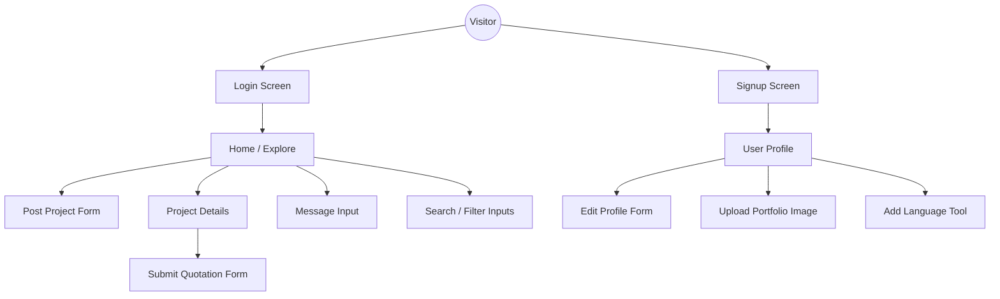

# MarketingOptix Input Screen Layouts

This document outlines all user input screens and forms within the project, detailing the fields and data points collected.

## 1. Input Flow & Navigation Diagram

The following diagram illustrates how users navigate between the different input screens in the application.

## 2. Authentication & Onboarding

### Registration (Signup)
- **Username**: Text input
- **Email Address**: Email input
- **Password**: Password input
- **Confirm Password**: Password input
- **User Role**: Radio selection (Client / Marketer)
- **Gender**: Radio selection (Male / Female / Other)
- **Date of Birth**: Date picker
- **Profile Picture**: File upload

### Login
- **Username**: Text input
- **Password**: Password input

---

## 2. Project Management (Client)

### Post a New Project
- **Project Title**: Text input (Strategic Headline)
- **Description**: Textarea (Detailed Specs)
- **Category**: Select dropdown
- **Strategic Services**: Multi-selection (Checkboxes for relevant services)
- **Project Budget**: Numeric input (Target Budget)
- **Collaborative Mode**: Radio selection (Online / Offline / Hybrid)

---

## 3. Account & Professional Profile

### Account Settings (Edit Profile)
- **Profile Avatar**: File upload (Real-time preview)
- **Username / Primary Email**: Text inputs
- **Contact Number**: Text input
- **Portfolio Website**: URL input
- **Strategic Location**: City selection (Dropdown)
- **Professional Bio**: Textarea (Expertise summary)
- **Gender Identity**: Radio selection

### Career Portfolio (On Profile Page)
- **Strategic Language**: Text input (Add linguistic skills)
- **Portfolio Gallery**: Multi-file upload (Showcase visual work)

---

## 4. Collaboration & Proposals (Marketer)

### Submit Strategic Quotation (Bid)
- **Strategic Budget**: Numeric input (Proposed bid)
- **Technical Proposal**: Textarea (Approach & Details)
- **Supporting Intel (PDF)**: File upload (Detailed documentation)

---

## 5. Communication & Feedback

### Messaging (Chat)
- **Strategic Intel**: Text input (Direct message content)

### Project Completion & Review
- **Feedback Summary**: Textarea (Reflective review)
- **Strategic Rating**: Numeric / Star selection (Performance score 1-5)

### Global Interactions
- **Intelligence Search**: Text input (Global project/service search)
- **Sector Filtering**: Select dropdown (Filter projects by service)
- **Newsletter Subscription**: Email input (Stay updated with trends)
