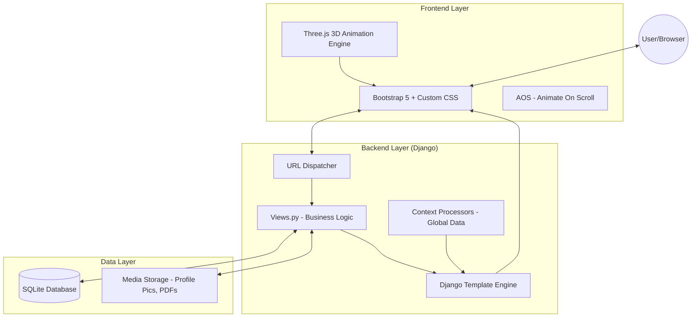
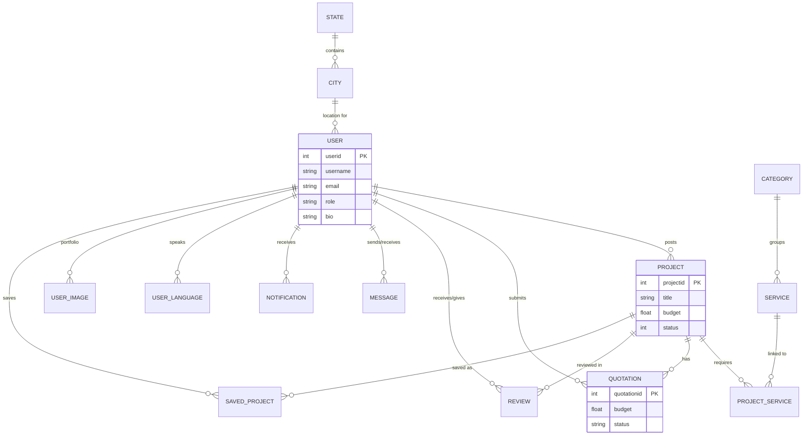
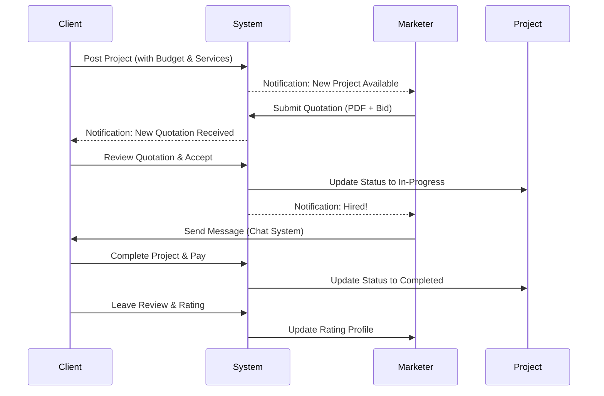

# MarketingOptix Project Diagram

This document provides a visual overview of the MarketingOptix project architecture, database schema, and core user flows.

## 1. System Architecture

The following diagram illustrates the high-level architecture of the Django-based application.

## 2. Entity Relationship (ER) Diagram

This diagram shows the relationships between the core database models in the `user` app.

## 3. Core User Flow (Hiring Process)

The sequence below illustrates the typical interaction between a Client and a Marketer.

